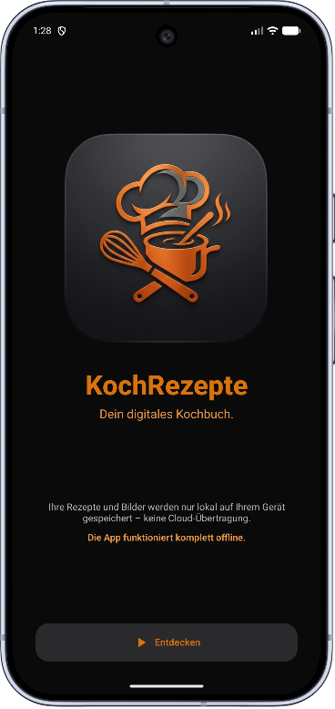
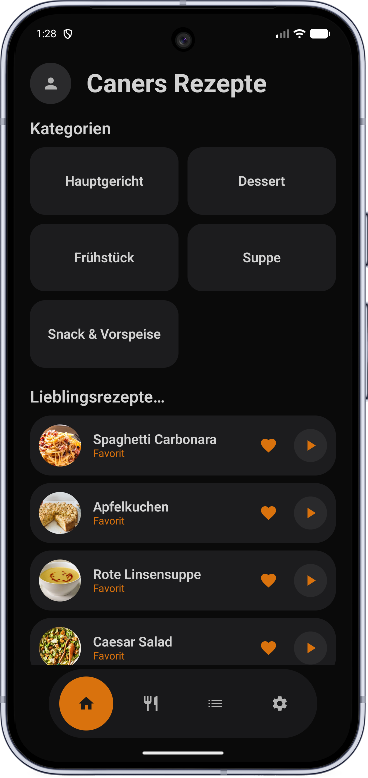
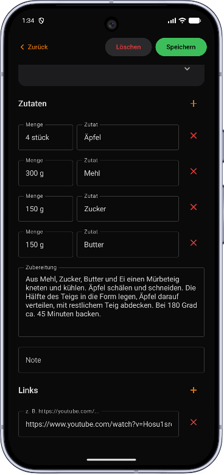
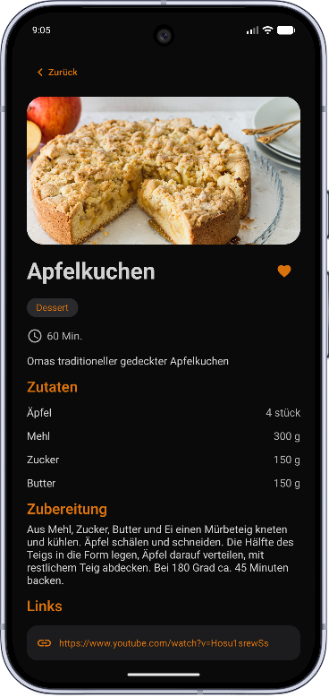

# KochRezepte – Dein digitales Kochbuch


**KochRezepte** ist eine native Android-Anwendung zum Erfassen, Organisieren und
Nachschlagen eigener Kochrezepte. Rezepte werden mit Titel, Beschreibung,
Zutatenliste, Zubereitungsschritten, Kategorien, Fotos und externen Links
(z. B. YouTube-Anleitungen) gepflegt – vollständig offline und ohne Cloud-Anbindung.

> ⚠️ **Hinweis:** Alle Rezepte, Kategorien und Bilder werden ausschließlich lokal
> auf dem Gerät gespeichert. Es besteht keinerlei Verbindung zu einem Server
> oder einer Cloud – die App funktioniert komplett offline.

---

## 📱 Screenshots

      

   

---

## ✨ Funktionen

### 🍳 Rezeptverwaltung
- Rezepte anlegen, bearbeiten und löschen
- Titel, Beschreibung, Zubereitungszeit (Min.), Zubereitungsschritte und Notizen
- Dynamische Zutatenliste (Menge + Zutat, beliebig viele Einträge)
- Externe Links pro Rezept (z. B. YouTube-Video, Blogpost) – anklickbar, öffnet
  YouTube-Links automatisch in der YouTube-App, falls installiert
- Zuordnung zu einer oder mehreren Kategorien

### 📖 Rezeptansicht
- Eigene Detailansicht getrennt vom Bearbeitungsformular
- Übersichtliche Darstellung von Bild, Kategorien, Zeit, Zutaten, Zubereitung,
  Notizen und Links
- Direktzugriff auf „Bearbeiten“ und „Löschen“ über zwei Buttons

### 🗂️ Kategorien
- Eigene Kategorien erstellen, umbenennen und löschen
- Kategoriebild, Rezeptanzahl je Kategorie
- Rezeptliste nach Kategorie filterbar

### ⭐ Favoriten
- Rezepte per Herz-Symbol als Favorit markieren
- Eigener „Meine Lieblingsrezepte“-Bereich auf dem Startbildschirm

### 🔍 Suche & Filter
- Volltextsuche in Rezept- und Kategorienlisten
- Filterung der Rezeptliste nach Kategorie

### 📷 Bilder (Kamera & Galerie)
- Fotos per Kamera (volle Auflösung) oder aus der Galerie hinzufügen
- Bilder werden in einen app-eigenen, privaten Ordner kopiert – sie erscheinen
  **nicht** in der Systemgalerie
- Löschen des Originalfotos aus der Galerie hat **keinen** Einfluss auf das in
  der App gespeicherte Bild (unabhängige Kopie)

### 💾 Datensicherung
- Export aller Rezepte, Kategorien und Bilder als ZIP-Datei
- Import / Wiederherstellung aus einer zuvor exportierten Backup-Datei
- Auswahl von Ziel-/Quellort über das native Dateisystem (Storage Access
  Framework) – vollständig lokal, kein Server

### 🎨 Benutzeroberfläche
- Durchgängiges Dark-Theme in Schwarz-/Grautönen mit Akzentfarbe „Orange“
- Material Design 3 (Jetpack Compose)
- Eigene Bottom-Navigation (Home / Rezepte / Kategorien / Einstellungen)

---

## 🔒 Datenschutz

- ✅ Alle Daten werden **ausschließlich lokal** auf dem Gerät gespeichert
- ✅ **Keine Internetverbindung** erforderlich
- ✅ Keine Datenübertragung an Server oder Dritte
- ✅ Eigene Bilder erscheinen nicht in der Systemgalerie
- ✅ Keine Werbung, kein Tracking

---

## 🛠️ Technologie-Stack

| Bereich | Technologie |
|---|---|
| Programmiersprache | **Kotlin** |
| UI-Framework | **Jetpack Compose** (Material Design 3) |
| Architektur | **MVVM** (ViewModel + Repository) |
| Rezept-/Kategoriendaten | **JSON-Dateispeicherung** (`kotlinx.serialization`, Internal Storage) |
| Einstellungen | **Jetpack DataStore** (Preferences) |
| Bildspeicherung | App-eigener privater Ordner (`filesDir/images`), Kopie statt Referenz |
| Bildanzeige | **Coil 3** (Compose) |
| Datensicherung | ZIP-Export/-Import (JSON + Bilder) über Storage Access Framework |
| Navigation | **Jetpack Navigation Compose** |
| Min. Android-Version | **Android 13** (API 33) |

---

## 📐 Architektur

com.example.kochrezepte/

├── data/

│   ├── model/           ← Datenmodelle (Recipe, Category, Ingredient, RecipeDatabase)

│   ├── local/            ← RecipeJsonStorage, ImageStorageManager, SettingsDataStore, BackupManager

│   └── repository/       ← RecipeRepository (einziger Zugriffspunkt auf alle Daten)

├── ui/

│   ├── screens/           ← Onboarding, Home, Kategorien, Rezeptliste, Rezeptansicht, Rezeptformular, Einstellungen

│   ├── components/       ← Wiederverwendbare UI-Komponenten (BottomNavBar, RecipeListItem)

│   └── theme/             ← Farben, Typografie, Theme (Orange / Dark)

├── viewmodel/            ← Geschäftslogik (RecipeViewModel, SettingsViewModel)

└── navigation/            ← AppDestinations, NavGraph

---

## 📋 Backup-Format

Der Export erzeugt eine ZIP-Datei mit folgendem Aufbau:

```
kochrezepte_backup.zip
├── recipes_database.json
└── images/
    ├── a1b2c3-....jpg
    └── ...
```

Auszug aus `recipes_database.json`:

```json
{
  "categories": [
    { "id": "cat-1", "name": "Abendessen", "imageFileName": null }
  ],
  "recipes": [
    {
      "id": "rec-1",
      "title": "Spaghetti Carbonara",
      "categoryIds": ["cat-1"],
      "description": "Klassisches italienisches Nudelgericht.",
      "timeMinutes": 30,
      "ingredients": [
        { "id": "ing-1", "name": "Ei", "amount": "2 Stück" }
      ],
      "preparation": "Nudeln kochen, ...",
      "note": "",
      "links": ["https://youtube.com/watch?v=..."],
      "imageFileName": "a1b2c3-....jpg",
      "isFavorite": true,
      "createdAt": 1750000000000
    }
  ]
}
```

---

## 📄 Lizenz

Dieses Projekt steht unter der **MIT-Lizenz** – siehe [LICENSE](license.txt) für Details.

---

## 👨‍💻 Entwickler

**Caner Oktay**
Android-Entwicklung mit Kotlin & Jetpack Compose

---

*Entwickelt mit ❤️ für alle, die ihre Rezepte an einem Ort sammeln möchten*
